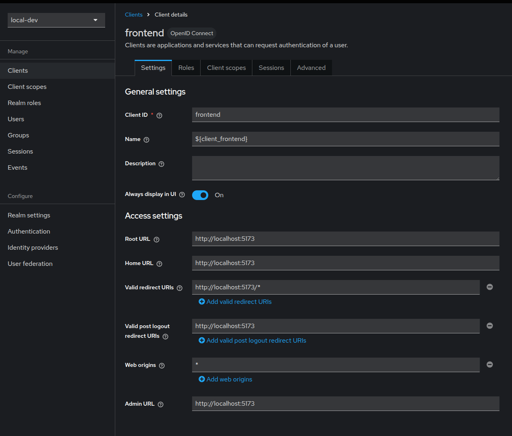
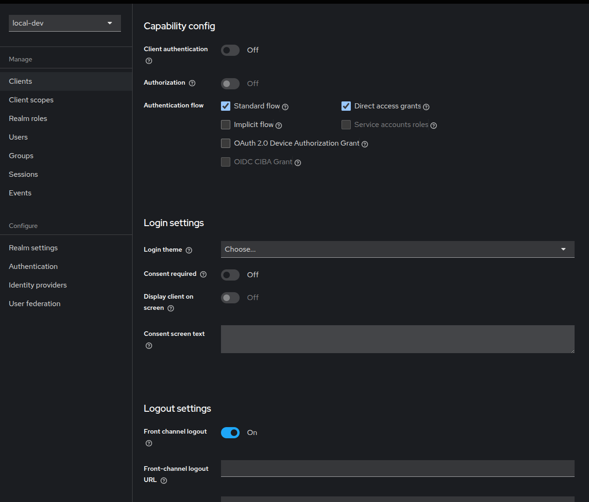
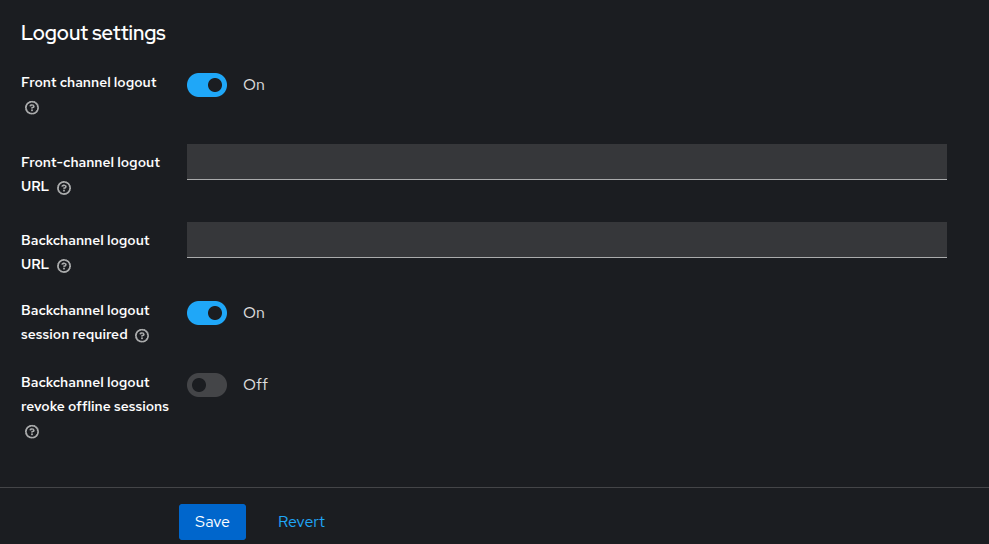

# 環境構築tips

vuetifyプロジェクトの作成

**下記動作確認済み**

```
npm install vuetify@latest
npm create vuetify@latest
npm run dev
```


**以下、うまく行かず**

```
npm create vite@latest ui -- --template vue
cd ui
npm install
```

```
npm install vuetify@latest
npm install vite-plugin-vuetify --save-dev
npm install sass sass-loader --save-dev
```


## Keycloak設定

realm `local-dev`を作成する。

client `frontend`を作成する。
設定内容は下記の通り。







client `fastapi-client`を作成し、
crient secretの生成(.envに記載)

testuserの作成(password: Password@02)


**openid discovery**

`http://localhost:8080/realms/local-dev/.well-known/openid-configuration`


下記のリクエストでtokenを取得できる。

```bash
curl -X POST http://localhost:8080/realms/local-dev/protocol/openid-connect/token \
 -d "grant_type=password" \
 -d "client_id=fastapi-client" \ 
 -d "client_secret=xxx" \
 -d "username=testuser" \
 -d "password=Password@01"
```

下記のリクエストでjwtkを取得できる。
```bash
curl -X GET http://localhost:8080/realms/local-dev/protocol/openid-connect/certs
```

## FastAPIの設定

認証用ライブラリをインストールする。

```
python-jose[cryptography]
httpx
python-dotenv
```


```
$ docker compose down api
$ docker compose build api
$ docker compose up -d api
$ docker compose exec api bash -c "pip install"
```


